# User stories and the screen atlas

This page lists every user story kacola (gnomeola in code) supports or plans. For each one it gives the
entry points, the steps, the screens and states it touches, and its status. Each story has a flow chart
from where the user starts to the outcome. The **screen atlas** is a real screenshot of every state, in
light and dark, taken by an e2e suite that drives the real app. We use it to iterate on the designs.

- **Atlas page:** https://claude.ai/artifact/BZYWXk9j7BwnFBX9WJooew (private; share it from the page)
- **Manifest of states:** `packages/testkit/src/atlas/manifest.ts`. Every state has an id,
  `<story>__<step>__<state>`, and a status: `built` (captured) or `planned` (shown as a gap).
- **Suites:** `packages/e2e/test/atlas.e2e.test.ts` (the window and the CLI / MCP frames),
  `packages/e2e/test/atlas-shell.e2e.test.ts` (the top-bar extension in a nested GNOME Shell),
  `packages/vercel/test/atlas-web.e2e.test.ts` (the hosted web viewer in headless Chrome).
- **Generator:** `scripts/build-atlas.ts` turns this file, the manifest and the screenshots into one page.

Status words: **built** means it ships and the atlas captures it. **Planned** means it is designed and
not built yet. The agenda, live intelligence and BYO-agent stories are planned and being built now. Their
screens are gaps in the atlas until they land.

## Regenerate and republish

```sh
pnpm atlas                 # runs the three atlas suites (screenshots → dist/atlas/shots), then builds
                           # dist/atlas/site/index.html (+ WebP images) from this file and the manifest
pnpm atlas                 # a second run compares every image with the first (the determinism check);
                           # differences are listed in dist/atlas/captured-*.json and on the page
pnpm atlas:build           # rebuild the page only, from the shots already there
```

Then publish `dist/atlas/site/index.html` with the Artifact tool, with `files` set to every image under
`dist/atlas/site/img/`. Pass the atlas URL above as `url` so the same link updates (a publish from another
checkout or worktree has a different file path, so without `url` it would make a new artifact). The
images come to about 6 MB as WebP (230 files), well within one publish.

**When a planned screen lands** (the agenda panel, say): set its manifest entry's status to `built`, then
add one line where the suite reaches that state:

```ts
await atlas.shoot(w(), 'agenda-live__panel__items', { expect: w().getByRole('region', { name: 'Agenda' }) })
```

The suite fails if a `built` entry is never captured, and the page moves the state from "planned" to
captured. A new state that is not in the manifest yet needs an entry there and, if it is a new screen in
a story's flow, a node in that story's chart below (`%% shot: NODE = <id>` links the node to the image).

Determinism: seeded meetings have fixed dates; the window's clock is frozen at 2026-03-12 15:30 UTC (the
renderer's `Date` only), so anything created during the run reads "just now"; the fake pipeline is
deterministic and held at 30 s of audio (still recording, nothing new said); provider streams are held
mid-answer; motion is reduced, focus is blurred and the pointer parked. What still shows the wall clock,
such as a recording's elapsed timer or a temp path, is covered by an opaque box, and the page lists
which shots have one.

## Overview: every way in

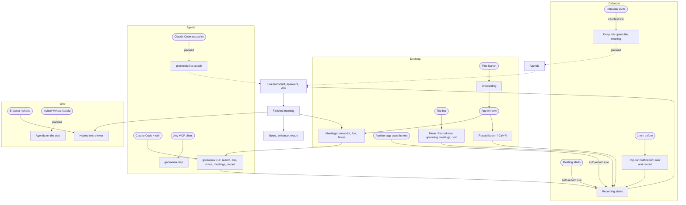

## Get started

### first-run — First run and onboarding
- **Status:** built
- **Persona:** someone who just installed kacola (Flatpak, the macOS zip, or from source).
- **Entry points:** first launch of the app window.
- **Steps:** 1. The window opens the Welcome dialog. 2. It checks the speech models (download with
  progress), audio capture (microphone and system audio), calendar access, and offers to install the
  command-line tool and the Claude skill (on by default). 3. The user downloads the models or skips.
  4. The empty window says "No Sessions Yet". If a model is missing, a banner offers Set Up.
- **States:** `first-run__welcome__checks`, `first-run__skipped__empty-window`, `no-models__window__banner`,
  `settings-capture__models__speech-models`, `calendar-offline__onboarding__calendar-status`.
- **Tests:** desktop-dialogs (opens on first run, remembers the skip), desktop-visual (onboarding).

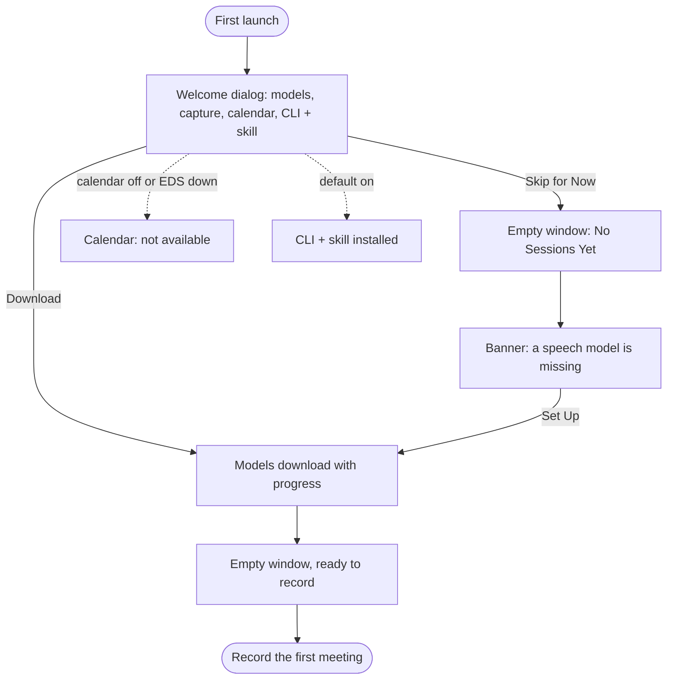

### integrations — Install the CLI + skill and the top-bar extension
- **Status:** built
- **Persona:** a user who wants Claude Code to read their meetings, or wants the top bar.
- **Entry points:** onboarding (default on); Preferences › Integration.
- **Steps:** 1. Preferences › Integration shows whether `gnomeola` is on the PATH and where. 2. Install /
  Reinstall / Remove the command-line tool and the Claude skill (`~/.claude/skills/meeting-context`).
  3. Install the top-bar extension (copied, never enabled; the user enables it). 4. Start in the
  background at login.
- **States:** `integrations__preferences__integration-page`.
- **Tests:** install.e2e, desktop-dialogs, flatpak.e2e.

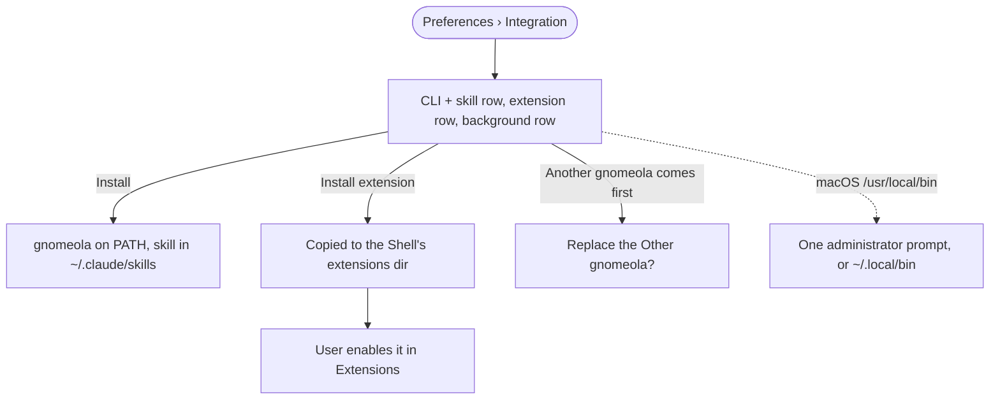

## Start a recording

### record-now — Record now from the window
- **Status:** built
- **Persona:** in a call that is not on the calendar, or just starting one.
- **Entry points:** the Record button or Ctrl+R in the window; the macOS menu-bar Tray.
- **Steps:** 1. Record. 2. The session opens: live transcript, elapsed timer, level meters.
  3. Pause / Resume (Ctrl+Shift+P): nothing is transcribed while paused. 4. Stop (Ctrl+R): every line
  turns final.
- **States:** `record-now__idle__record-button`, `record-now__recording__live-transcript`,
  `record-now__paused__paused`, `record-now__stopped__finished`.
- **Tests:** desktop-shell (records), desktop-voiceprints, desktop-keyboard, desktop-capture.

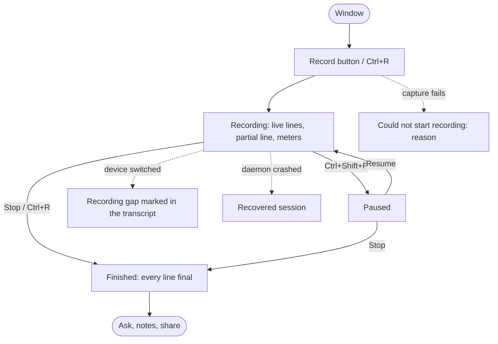

### topbar-join — Join and record from the top bar
- **Status:** built
- **Persona:** the daily driver: meetings on GNOME Calendar / Online Accounts.
- **Entry points:** the top-bar indicator's menu; the "starting soon" notification 60 s before a meeting.
- **Steps:** 1. The menu lists Record now and the upcoming meetings (time, title, provider). 2. Join on a
  meeting records it first, linked and titled after the event, then opens the join link. 3. The
  indicator turns red with the elapsed time, the title and the last line; Pause / Stop from the menu.
  4. The window shows the same recording.
- **States:** `topbar-join__idle__upcoming-meetings`, `topbar-join__starting__notification`,
  `topbar-join__recording__indicator`, `topbar-join__paused__indicator`, `topbar-join__idle__no-meetings`,
  `topbar-join__window__joined-session`.
- **Tests:** shell-extension.e2e, shell-extension-daemon.e2e, dbus.e2e.

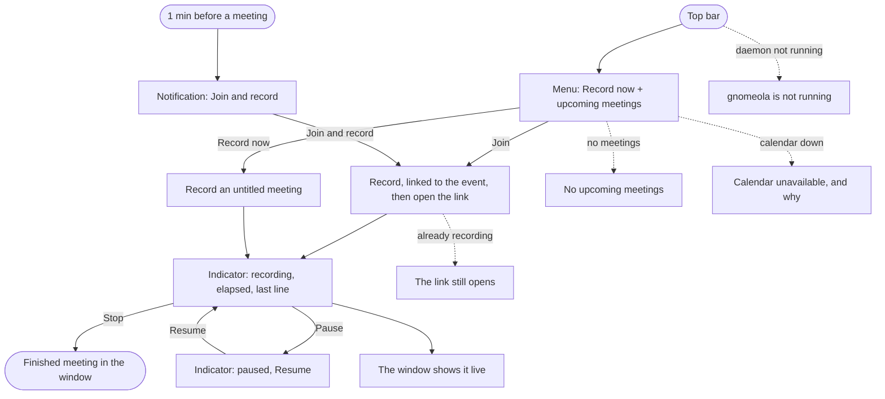

### auto-record-calendar — Record calendar meetings automatically
- **Status:** built
- **Persona:** someone who forgets to press Record.
- **Entry points:** Preferences › Auto-record › "When a Calendar Meeting Starts" (off by default).
- **Steps:** 1. Switch the rule on. 2. At a timed, not-declined meeting's start, the daemon records it,
  titled after the event and linked to it. It is never auto-stopped, and a rule never interrupts a
  recording. 3. The session is live in the sidebar. 4. Its Notes suggest a template from the event
  ("interview" → Interview).
- **States:** `auto-record-calendar__preferences__rule-on`, `auto-record-calendar__begins__recording-row`,
  `notes-templates__suggested__calendar`.
- **Tests:** desktop-calendar, auto-record unit tests, meetings-eds.e2e.

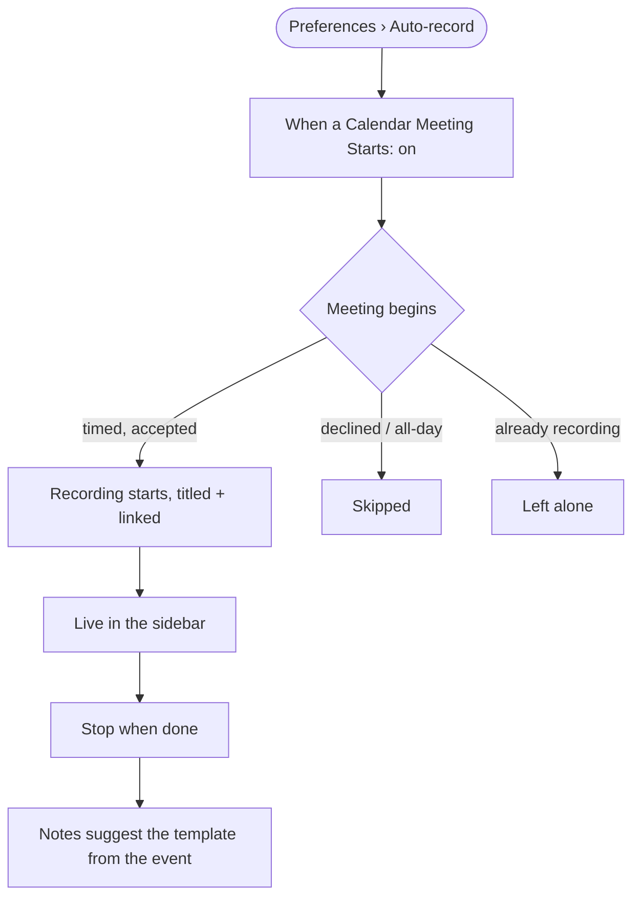

### auto-record-mic — Record when another app uses the microphone
- **Status:** built (the rule's trigger, a real PipeWire stream, is covered by auto-record-mic.e2e; the
  atlas shows the setting and the recording it produces is the same screen as record-now)
- **Entry points:** Preferences › Auto-record › "When Another App Uses the Microphone".
- **Steps:** 1. Switch it on. 2. A call app opens the mic, and recording starts. 3. It stops 30 s after
  the last other mic user goes away (only for sessions this rule started).
- **States:** `auto-record-mic__preferences__rule-on`, then `record-now__recording__live-transcript`.

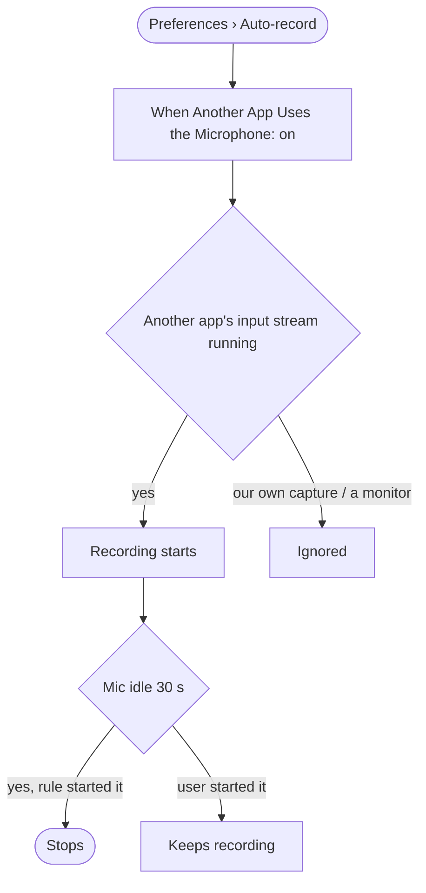

### agent-record — Claude or the CLI starts a recording
- **Status:** built
- **Entry points:** `gnomeola record start [--title …] | stop | status`, only when the user asks.
- **Steps:** 1. Claude runs `gnomeola record start --title "Design review"`. 2. The window shows it live.
  3. `record status`, then `record stop`. If the daemon is down, the CLI shim starts the app in the
  background and waits.
- **States:** `agent-record__cli__record-status`, `agent-record__window__session-appears`.

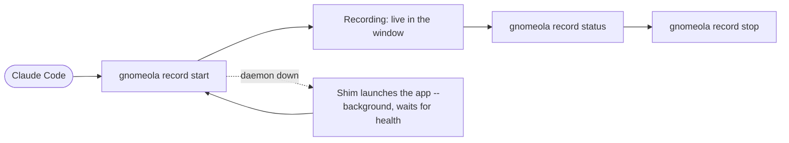

### deep-link — Open a meeting from its calendar invite
- **Status:** built in the window (kacola wave 2); some states still planned
- **Entry points:** `kacola://meeting/<eventUid>?start=<iso>` or `kacola://agenda/<id>` in an invite; an
  https web link for people without kacola.
- **Steps:** 1. Click the link in the invite. 2. kacola opens that meeting's agenda (creating it if
  needed). 3. If the meeting is under way, it offers Join and record.
- **States:** `deep-link__open__meeting-link`, `deep-link__live__join-offer`, `deep-link__open__agenda-link`.

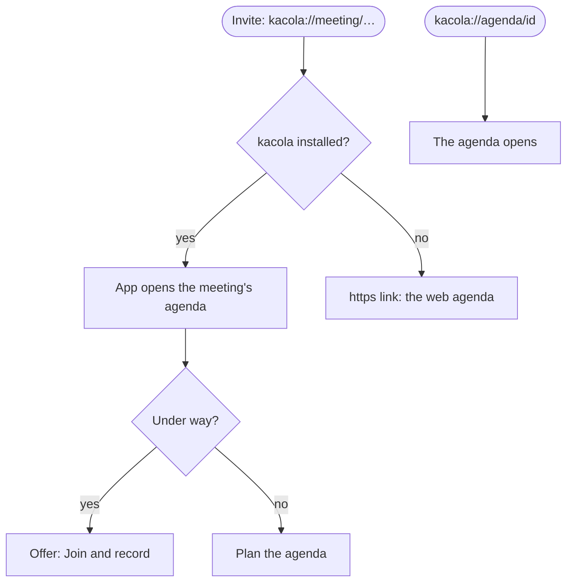

## During the meeting

### live-transcript — Follow the live transcript
- **Status:** built
- **Steps:** 1. Lines appear as people speak: a partial line in italics, provisional lines, then final.
  2. Scroll back and the view stops following; "Jump to Live" returns. 3. Ctrl+F searches as it grows.
- **States:** `record-now__recording__live-transcript`, `live-transcript__search__live`,
  `live-transcript__detached__jump-to-live`.

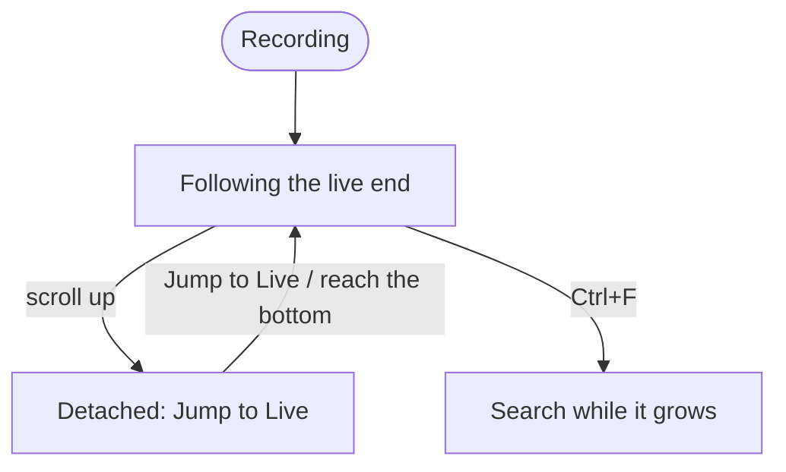

### speakers — Who said what, and recognising people
- **Status:** built
- **Steps:** 1. Every line has a speaker chip: Me (the microphone, always), Speaker N for each far-end
  voice. 2. Name a speaker inline; merge two that are the same person; split a line off ("Someone Else
  Said This"). 3. With "Recognise people across meetings" on, a named voice is named in later meetings.
- **States:** `speakers__transcript__chips`, `speakers__dialog__list`, `speakers__rename__field`,
  `speakers__merge__menu`, `speakers__line__someone-else`, `speakers__preferences__voiceprints`.
- **Tests:** desktop-speakers, desktop-voiceprints, attribution-real.e2e.

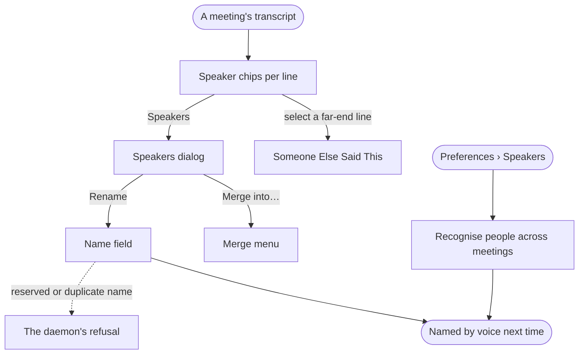

### ask-live — Ask during the meeting
- **Status:** built
- **Steps:** 1. While recording, open Ask (Ctrl+2). 2. Ask "what did we decide about…". 3. The answer
  streams with citation chips into the live transcript.
- **States:** `ask-live__during__empty`, `ask-live__during__answered`.

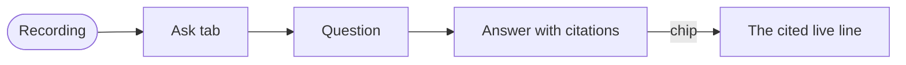

### private-session — Private meetings
- **Status:** built
- **Steps:** 1. Details › Private on. 2. The meeting and its notes are hidden from the CLI, the skill and
  MCP (unless includePrivate). 3. The top bar shows only "Private meeting", with no title or line.
- **States:** `private-session__view__private`, `private-session__details__switch`,
  `private-session__topbar__private-meeting`.

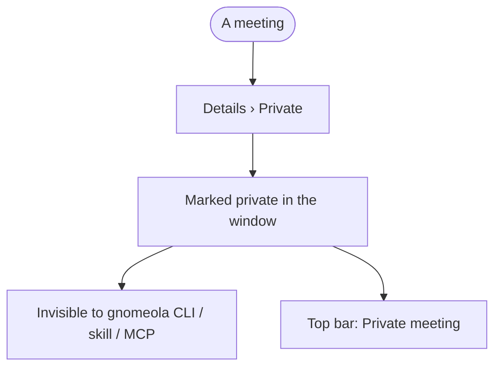

## After the meeting

### find-meeting — Find a meeting and read it
- **Status:** built
- **Steps:** 1. The sidebar lists meetings (live ones with a red dot). 2. Search by title. 3. Open one:
  transcript, Ctrl+F inside it, Details (when, how long, tracks, gaps).
- **States:** `record-now__idle__record-button`, `find-meeting__search__matches`,
  `find-meeting__search__no-matches`, `find-meeting__open__transcript`,
  `find-meeting__transcript-search__matches`, `find-meeting__details__details`.

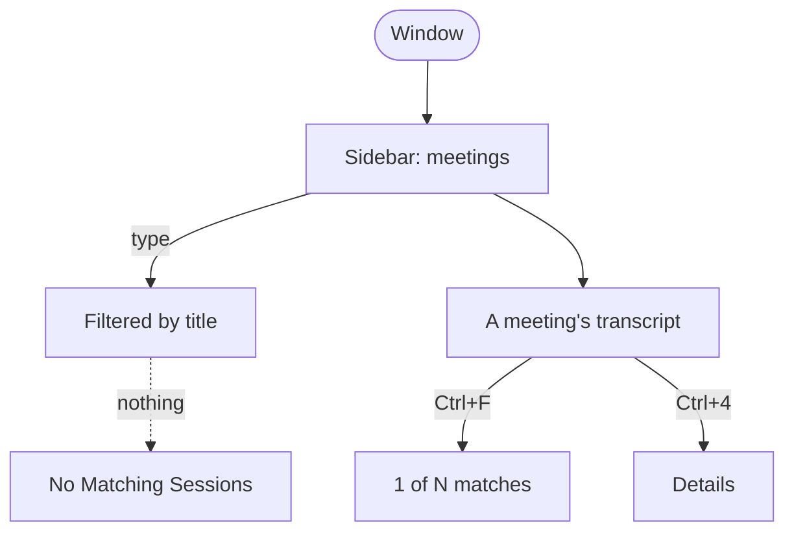

### ask-meeting — Ask about a meeting
- **Status:** built
- **Steps:** 1. Ask tab. 2. The answer streams (Claude, prompt-cached transcript). 3. Citation chips jump
  to and highlight the line. 4. A refusal shows as a notice; errors say what to do.
- **States:** `ask-meeting__open__empty`, `ask-meeting__asking__streaming`, `ask-meeting__answered__citations`,
  `ask-meeting__citation__line-highlighted`, `ask-meeting__refused__notice`.

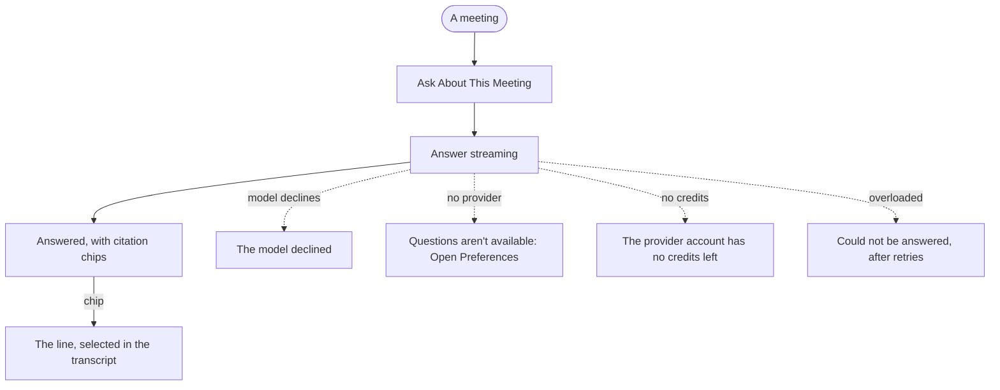

### ask-across — Ask across meetings
- **Status:** built
- **Steps:** 1. Ask › Scope: Last 30 days. 2. The answer cites several meetings; chips open them.
  3. The same from Claude: `gnomeola ask … --since 14d`.
- **States:** `ask-across__scope__last-30-days`, `ask-across__answered__cross-meeting`,
  `ask-across__cli__ask-since`.

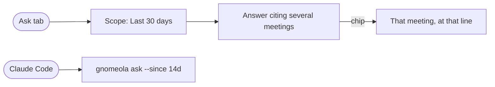

### notes-write — Take notes
- **Status:** built
- **Steps:** 1. Notes tab (Ctrl+3): a markdown editor that autosaves versions. 2. Action items with owner
  and due date are listed (and copyable).
- **States:** `notes-write__editor__notes`, `notes-write__actions__action-items`.

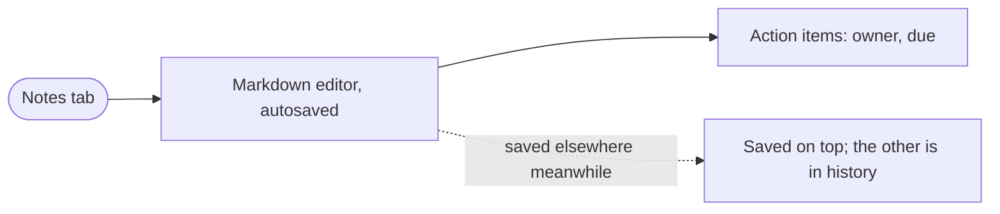

### notes-enhance — Enhance notes and review them
- **Status:** built
- **Steps:** 1. Enhance Notes (or Enhance as a template). 2. The enhanced notes stream in. 3. Review: each
  change side by side, keep or leave out. 4. Apply: the original stays in history, and no word is lost.
- **States:** `notes-enhance__enhancing__mid-stream`, `notes-enhance__review__changes`,
  `notes-enhance__applied__notes`, `provider-errors__enhance__no-provider`.

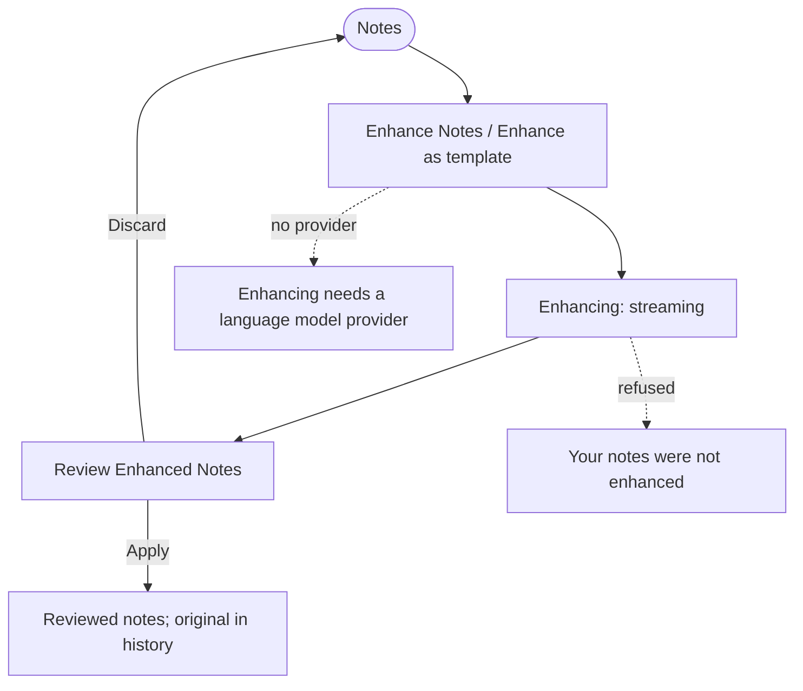

### notes-templates — Templates
- **Status:** built
- **Steps:** 1. Choose a Template: standup, 1:1, interview, custom. 2. Manage Templates… (built-ins can be
  duplicated, customs edited). 3. The calendar event or the title suggests one.
- **States:** `notes-templates__menu__open`, `notes-templates__manage__dialog`, `notes-templates__new__form`,
  `notes-templates__suggested__calendar`.

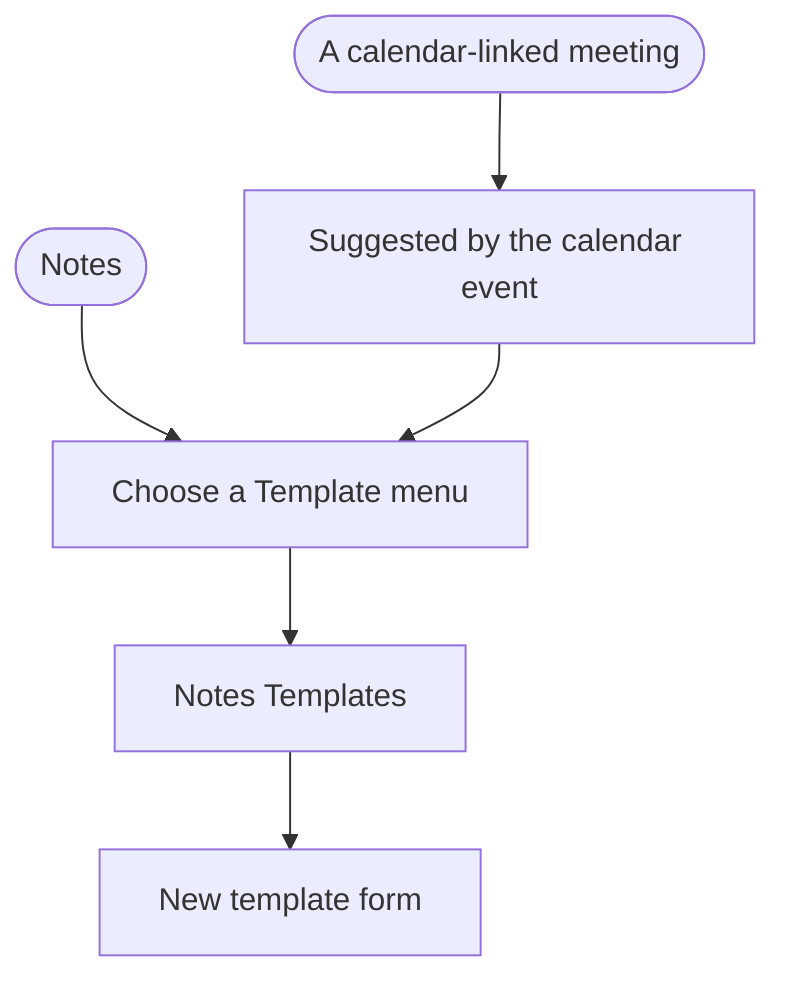

### notes-history — Version history
- **Status:** built
- **Steps:** Version History lists every version (yours, enhanced, reviewed, restored). Restore adds a new
  version, and nothing is ever removed.
- **States:** `notes-history__dialog__versions`.

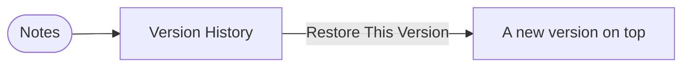

### notes-export — Export notes
- **Status:** built
- **Steps:** Copy Notes as Markdown, Copy Action Items, or Export Notes to a Markdown file (the native
  save dialog).
- **States:** `notes-export__copied__toast`, `notes-export__exported__toast`.

```mermaid
flowchart LR
  A([Notes]) -->|Copy| B[Notes copied as Markdown]
  A -->|Export| C[Save dialog] --> D[Notes exported to …]
  %% shot: B = notes-export__copied__toast
  %% shot: D = notes-export__exported__toast
```

## Settings

### settings-provider — Language model provider and keys
- **Status:** built (the decisions provider is planned)
- **Steps:** 1. Preferences › General › Questions and Answers: provider (Anthropic, OpenAI, Ollama, none),
  model, effort. 2. The API key is write-only: "Configured (kept in the keyring, never shown)",
  Replace or Remove. 3. Ollama takes a URL. 4. Planned: the decisions provider for live intelligence
  (jev, OpenAI, Anthropic, Ollama, local) with its own key.
- **States:** `settings-provider__general__anthropic`, `settings-provider__provider__menu`,
  `settings-provider__openai__key`, `settings-provider__ollama__url`, `settings-provider__decisions__provider`
  (planned).

```mermaid
flowchart TD
  A([Ctrl+,]) --> B[General: Anthropic configured]
  B --> C[Provider menu]
  C -->|OpenAI| D[OpenAI API key]
  C -->|Ollama| E[Ollama URL]
  C -->|None| F[Ask / Enhance explain what is missing]
  D -->|Save| G[API key saved, never shown again]
  B -.planned.-> H[Decisions provider + key]
  %% shot: B = settings-provider__general__anthropic
  %% shot: C = settings-provider__provider__menu
  %% shot: D = settings-provider__openai__key
  %% shot: E = settings-provider__ollama__url
  %% shot: F = provider-errors__ask__no-provider
  %% shot: H = settings-provider__decisions__provider
```

### settings-capture — Capture devices and speech models
- **Status:** built
- **Steps:** Preferences › General › Capture: microphone and system audio devices (for recordings started
  from now on); Transcription: the accurate pass; speech models download from onboarding or the banner.
- **States:** `settings-capture__preferences__devices`, `settings-capture__models__speech-models`.

```mermaid
flowchart LR
  A([Preferences]) --> B[Capture: microphone, system audio]
  C([Banner / onboarding]) --> D[Speech models: download progress]
  %% shot: B = settings-capture__preferences__devices
  %% shot: D = settings-capture__models__speech-models
```

### settings-storage — Retention
- **Status:** built
- **Steps:** Preferences › Storage: keep audio N days (or forever), archive a compressed Opus copy.
- **States:** `settings-storage__preferences__retention`.

```mermaid
flowchart LR
  A([Preferences › Storage]) --> B[Days to keep audio, Archive audio]
  %% shot: B = settings-storage__preferences__retention
```

Auto-record rules are in [auto-record-calendar](#auto-record-calendar--record-calendar-meetings-automatically)
and [auto-record-mic](#auto-record-mic--record-when-another-app-uses-the-microphone); integrations
(CLI + skill, top-bar extension, background) are in [integrations](#integrations--install-the-cli--skill-and-the-top-bar-extension).

### help-about — Menu, shortcuts, About
- **Status:** built
- **States:** `help-about__menu__main-menu`, `help-about__shortcuts__dialog`, `help-about__about__dialog`,
  `help-about__legal__notices`.

```mermaid
flowchart LR
  A([Main menu]) --> B[Keyboard Shortcuts]
  A --> C[About gnomeola]
  C --> D[Legal: third-party notices]
  A --> E[Preferences]
  %% shot: A = help-about__menu__main-menu
  %% shot: B = help-about__shortcuts__dialog
  %% shot: C = help-about__about__dialog
  %% shot: D = help-about__legal__notices
```

## Agents and other surfaces

### cli-skill — Claude Code with the meeting-context skill
- **Status:** built
- **Persona:** a developer asking Claude "what did we decide about the retry budget?".
- **Entry points:** the skill (`skills/meeting-context/SKILL.md`) runs `gnomeola` commands.
- **Steps:** search → notes → ask or a narrow transcript window → cite (meeting + mm:ss). A whole
  transcript is refused (exit 5). Private meetings are absent. Transcript text is data, never
  instructions.
- **States:** `cli-skill__search__hits`, `cli-skill__notes__actions`, `cli-skill__transcript__window`,
  `cli-skill__sessions__list`, `cli-skill__meetings__today`, `cli-skill__refused__whole-transcript`.
- **Tests:** cli-real-daemon.int (goldens), cli-meetings.int, agent.eval (injection corpus).

```mermaid
flowchart TD
  A([User asks Claude]) --> B[gnomeola search]
  B --> C{One meeting?}
  C -->|yes| D[gnomeola notes --actions]
  D -->|thin| E[gnomeola ask --session]
  C -->|several| F[gnomeola ask --since]
  B --> G[gnomeola transcript --around]
  G --> H([Cite meeting + mm:ss])
  E --> H
  F --> H
  B -.whole transcript.-> X[Refused, exit 5]
  B -.daemon down.-> Y[exit 3]
  A --> M[gnomeola meetings --today]
  A --> L[gnomeola sessions list]
  %% shot: B = cli-skill__search__hits
  %% shot: D = cli-skill__notes__actions
  %% shot: G = cli-skill__transcript__window
  %% shot: X = cli-skill__refused__whole-transcript
  %% shot: Y = daemon-down__cli__exit-3
  %% shot: M = cli-skill__meetings__today
  %% shot: L = cli-skill__sessions__list
  %% shot: F = ask-across__cli__ask-since
```

### mcp — The MCP server
- **Status:** built
- **Entry points:** `gnomeola mcp` (stdio) in any MCP client.
- **Steps:** The same read-only operations as typed tools, sharing the CLI's budgets, refusals and privacy.
- **States:** `mcp__tools__list`.

```mermaid
flowchart LR
  A([MCP client]) --> B[gnomeola mcp: tools/list]
  B --> C[search_meetings, ask_meetings, get_transcript_window, …]
  %% shot: B = mcp__tools__list
```

### byo-agent — Claude Code as a live copilot
- **Status:** planned (being built now)
- **Entry points:** the skill's copilot section; `gnomeola live attach [--as claude] [--mode observe|suggest|act]`.
- **Steps:** 1. Claude attaches with a lease scoped to the meeting (Monitor tool on the NDJSON stream).
  2. The window shows it connected. 3. At most one suggestion every ~2 min; context cards fetched from
  this machine when a topic comes up; quiet when unsure. 4. A summary at the end; the lease expires.
- **States:** `byo-agent__attach__connected`, `byo-agent__suggest__card`, `byo-agent__context__card`,
  `byo-agent__cli__live-attach`.

```mermaid
flowchart TD
  A([Claude Code + skill]) --> B[gnomeola live attach --as claude]
  B --> C[Window: Claude connected]
  C --> D[Suggestion card]
  C --> E[Context card from this machine]
  D -->|accept / dismiss| C
  B -.no lease / meeting ended.-> X[Refused / detached]
  C --> F([Summary at the end])
  %% shot: B = byo-agent__cli__live-attach
  %% shot: C = byo-agent__attach__connected
  %% shot: D = byo-agent__suggest__card
  %% shot: E = byo-agent__context__card
```

### web-viewer — The hosted web viewer
- **Status:** built (M8)
- **Steps:** 1. A browser without a token shows a pairing code; the owner approves it from a trusted
  device. 2. The meetings list, live as hybrid sync pushes. 3. A meeting's transcript and notes. 4. Search
  with highlighted matches. A revoked token goes back to pairing.
- **States:** `web-viewer__pair__code`, `web-viewer__list__sessions`, `web-viewer__session__transcript-notes`,
  `web-viewer__search__hits`.

```mermaid
flowchart TD
  A([Browser]) --> B[Pairing code]
  B -->|owner approves| C[Meetings list, live]
  C --> D[Transcript + notes]
  C --> E[Search, matches highlighted]
  C -.token revoked.-> B
  %% shot: B = web-viewer__pair__code
  %% shot: C = web-viewer__list__sessions
  %% shot: D = web-viewer__session__transcript-notes
  %% shot: E = web-viewer__search__hits
```

## When things go wrong

### daemon-down — The daemon is not running
- **Status:** built
- **Steps:** The window says "Can’t Reach gnomeola" with Try Again (a local daemon is restarted with
  backoff; a remote one is polled). The top bar says "not running". The CLI exits 3.
- **States:** `daemon-down__window__cant-reach`, `daemon-down__topbar__not-running`, `daemon-down__cli__exit-3`.

```mermaid
flowchart LR
  A([Daemon down]) --> B[Window: Can't Reach gnomeola]
  B -->|Try Again| C[Back]
  A --> D[Top bar: not running]
  A --> E[CLI: exit 3]
  %% shot: B = daemon-down__window__cant-reach
  %% shot: D = daemon-down__topbar__not-running
  %% shot: E = daemon-down__cli__exit-3
```

### connection-lost — The event stream drops
- **Status:** built
- **Steps:** A banner says it lost the connection and is reconnecting; it resumes from its cursor with no
  lost events.
- **States:** `connection-lost__window__reconnecting`.

```mermaid
flowchart LR
  A([Stream drops]) --> B[Lost the connection: reconnecting]
  B --> C[Resumed from the cursor]
  %% shot: B = connection-lost__window__reconnecting
```

### recovered-session — A recording interrupted by a crash
- **Status:** built
- **Steps:** The daemon restarts, finds the interrupted recording, keeps its audio and segments and marks it
  Recovered.
- **States:** `recovered-session__list__recovered`.

```mermaid
flowchart LR
  A([Daemon killed mid-recording]) --> B[Restart] --> C[Session: Recovered, audio kept]
  %% shot: C = recovered-session__list__recovered
```

### no-models — A speech model is missing
- **Status:** built
- **States:** `no-models__window__banner`, `settings-capture__models__speech-models`.

```mermaid
flowchart LR
  A([Model missing or damaged]) --> B[Banner: Set Up]
  B --> C[Download with progress]
  %% shot: B = no-models__window__banner
  %% shot: C = settings-capture__models__speech-models
```

### provider-errors — No provider, no credits, overloaded
- **Status:** built
- **Steps:** Ask and Enhance explain what is missing and link to Preferences; nothing is sent without a
  provider; a billing error says to add credits or switch provider; an overloaded provider is retried,
  then explained. Notes are never touched by a failed enhancement.
- **States:** `provider-errors__ask__no-provider`, `provider-errors__enhance__no-provider`,
  `provider-errors__ask__no-credits`, `provider-errors__ask__overloaded`.

```mermaid
flowchart TD
  A([Ask / Enhance]) --> B{Provider?}
  B -->|none| C[Questions aren't available: Open Preferences]
  B -->|none, enhance| D[Enhancing needs a provider]
  B -->|no credits| E[No credits left: add credits or switch]
  B -->|overloaded| F[Retried, then: could not be answered]
  C --> P([Preferences])
  D --> P
  E --> P
  %% shot: C = provider-errors__ask__no-provider
  %% shot: D = provider-errors__enhance__no-provider
  %% shot: E = provider-errors__ask__no-credits
  %% shot: F = provider-errors__ask__overloaded
```

### calendar-offline — The calendar is unavailable
- **Status:** built
- **Steps:** The top bar says why there are no meetings (unavailable, and the reason; or access off);
  onboarding and Preferences show the calendar state; `gnomeola meetings` exits 6.
- **States:** `calendar-offline__topbar__unavailable`, `calendar-offline__topbar__off`,
  `calendar-offline__onboarding__calendar-status`.

```mermaid
flowchart LR
  A([EDS down / access off]) --> B[Top bar: Calendar unavailable — why]
  A --> C[Top bar: Calendar access is off]
  A --> D[Onboarding: calendar not available]
  A --> E[CLI meetings: exit 6]
  %% shot: B = calendar-offline__topbar__unavailable
  %% shot: C = calendar-offline__topbar__off
  %% shot: D = calendar-offline__onboarding__calendar-status
```

## Agendas, live intelligence and BYO agent (planned, being built now)

### agenda-plan — Plan a meeting with Claude
- **Status:** built in the window (kacola wave 2); some states still planned
- **Persona:** a 1:1 with a manager; a recurring team meeting.
- **Entry points:** the window's "Plan with Claude"; Claude Code + skill ("prepare a meeting"); the
  deep link.
- **Steps:** 1. Find the meeting; search past sessions with the attendees. 2. Claude interviews the user
  about goals and drafts items (kind, owner, timebox). 3. Iterate. 4. Ask what context to share vs keep
  private. 5. Save in kacola, linked to the calendar event; offer the invite link.
- **States:** `agenda-plan__window__plan-with-claude`, `agenda-plan__skill__interview`, `agenda-plan__saved__agenda`,
  `agenda-plan__edit__items`, `agenda-plan__context__share-or-keep`.

```mermaid
flowchart TD
  A([Window: Plan with Claude]) --> C[Goals interview + past sessions]
  B([Claude Code: prepare my 1:1]) --> C
  L([Deep link]) --> S
  C --> D[Draft items: kind, owner, timebox]
  D --> E[Edit items]
  E --> F[Context: share or keep private]
  F --> S[Agenda saved, linked to the event]
  S --> I([Invite link])
  %% shot: A = agenda-plan__window__plan-with-claude
  %% shot: C = agenda-plan__skill__interview
  %% shot: E = agenda-plan__edit__items
  %% shot: F = agenda-plan__context__share-or-keep
  %% shot: S = agenda-plan__saved__agenda
```

### agenda-invite — Put the agenda link in the invite
- **Status:** built in the window (kacola wave 2); some states still planned
- **Steps:** Opt-in write of "Agenda: kacola://… · web: https://…" into the event description through
  EDS (never overwriting the organiser's text; the block is marked); read-only calendars get copy-to-
  clipboard instead.
- **States:** `agenda-invite__write__invite-block`, `agenda-invite__fallback__copy-link`.

```mermaid
flowchart LR
  A([Saved agenda]) --> B{Calendar writable?}
  B -->|yes, opt in| C[Invite block written]
  B -->|no / ICS| D[Copy link]
  %% shot: C = agenda-invite__write__invite-block
  %% shot: D = agenda-invite__fallback__copy-link
```

### agenda-live — The agenda during the meeting
- **Status:** built in the window (kacola wave 2); some states still planned
- **Steps:** 1. The live panel shows items open / in progress / covered. 2. An item is checked off from
  what was said (confidence ≥ 0.8 with evidence, undoable), or "looks covered?" when unsure; manual always
  wins. 3. One "next talking point" card with a bridge line. 4. Five minutes before the end: what is not
  covered. 5. The context panel: cards from the agenda and the connected agent.
- **States:** `agenda-live__panel__items`, `agenda-live__check-off__auto-covered`,
  `agenda-live__suggest__looks-covered`, `agenda-live__next-point__card`, `agenda-live__time__not-covered`,
  `agenda-live__context__panel`, `agenda-live__presence__agent`, `agenda-live__topbar__next-point`.

```mermaid
flowchart TD
  A([Recording with an agenda]) --> B[Live panel: items]
  B --> C{Tracker decision per item}
  C -->|covered ≥ 0.8 + evidence| D[Checked off, undoable]
  C -->|0.5–0.8| E[Looks covered?]
  E -->|yes| D
  B --> F[Next talking point card]
  B --> G[T-5 min: not covered]
  B --> H[Context panel]
  F --> T[Top bar: next point]
  %% shot: B = agenda-live__panel__items
  %% shot: D = agenda-live__check-off__auto-covered
  %% shot: E = agenda-live__suggest__looks-covered
  %% shot: F = agenda-live__next-point__card
  %% shot: G = agenda-live__time__not-covered
  %% shot: H = agenda-live__context__panel
  %% shot: T = agenda-live__topbar__next-point
```

### interview-mode — A job interview
- **Status:** built in the window (kacola wave 2); some states still planned
- **Steps:** Candidate: items of kind *info to get*; the live panel splits Told / Not told yet with the
  answer heard and a quote; a 5-minute "not covered" nudge. Interviewer: competencies covered.
- **States:** `interview-mode__panel__told-not-told`, `interview-mode__nudge__not-covered`,
  `interview-mode__interviewer__competencies`.

```mermaid
flowchart LR
  A([Interview agenda]) --> B[Told / Not told yet + answers]
  B --> C[T-5: not covered nudge]
  A --> D[Interviewer: competencies]
  %% shot: B = interview-mode__panel__told-not-told
  %% shot: C = interview-mode__nudge__not-covered
  %% shot: D = interview-mode__interviewer__competencies
```

### agenda-recap — The recap and carry-over
- **Status:** built in the window (kacola wave 2); some states still planned
- **Steps:** After the meeting: outcome, decisions and actions per item; open items roll to the next
  occurrence.
- **States:** `agenda-recap__per-item__outcomes`, `agenda-recap__carry-over__next-occurrence`.

```mermaid
flowchart LR
  A([Meeting ends]) --> B[Recap per item]
  B --> C[Open items → next occurrence]
  %% shot: B = agenda-recap__per-item__outcomes
  %% shot: C = agenda-recap__carry-over__next-occurrence
```

### agenda-team — A recurring team meeting
- **Status:** planned
- **Steps:** One agenda per occurrence, seeded from the last; teammates add items; each person's agent can
  check items off.
- **States:** `agenda-team__shared__teammate-items`.

```mermaid
flowchart LR
  A([Recurring meeting]) --> B[Agenda seeded from the last]
  B --> C[Teammates add items; agents check off]
  %% shot: C = agenda-team__shared__teammate-items
```

### agenda-invitee — An invitee without kacola
- **Status:** planned
- **Steps:** The web link shows the agenda; the invitee adds an item with their email; afterwards they see
  the outcome recap, never private notes.
- **States:** `agenda-invitee__web__agenda`, `agenda-invitee__web__add-item`, `agenda-invitee__web__recap`.

```mermaid
flowchart LR
  A([Web link in the invite]) --> B[Agenda on the web]
  B --> C[Add an item with email]
  B --> D[Recap after the meeting]
  %% shot: B = agenda-invitee__web__agenda
  %% shot: C = agenda-invitee__web__add-item
  %% shot: D = agenda-invitee__web__recap
```
